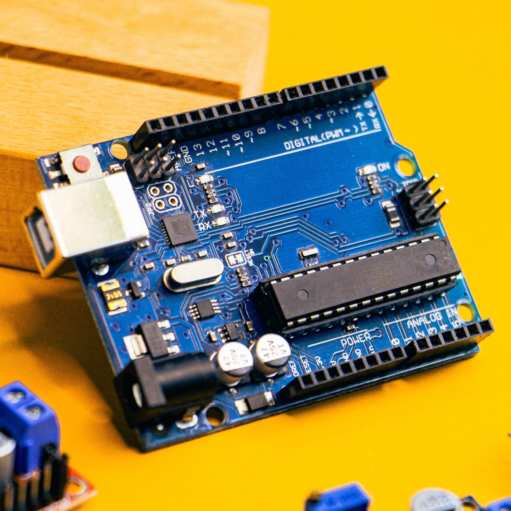
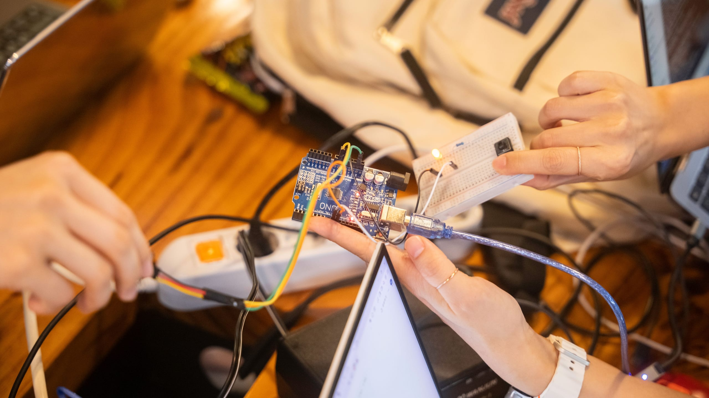

Alla biblioteca civica **Franco Galato** di Gorgonzola, fra romanzi e guide
turistiche, c'è anche uno scaffale che non ti aspetti: alcuni kit Arduino,
completi di scheda, componenti e strumenti. Un kit si prende in prestito con la
tessera della biblioteca, esattamente come un libro: te lo porti a casa, ci
smanetti e poi lo riporti.

L'idea è semplice: cominciare con l'elettronica non dovrebbe richiedere di
comprare niente, né di sapere già da che parte si impugna un saldatore. Prima
provi, poi decidi se ti piace.

## Che cos'è Arduino



[Arduino](https://it.wikipedia.org/wiki/Arduino_(hardware)) è una piccola scheda
elettronica, grande più o meno come un mazzo di carte, con sopra un
microcontrollore: un minuscolo computer che fa una cosa sola, quella che gli
scrivi tu. Si collega al computer con un cavo USB, gli si carica un programma e
da quel momento la scheda lo esegue da sola.

Ai suoi piedini si attaccano i componenti: un LED da accendere, un pulsante da
leggere, un sensore di temperatura, un motorino da far girare. Il programma
decide cosa succede, per esempio *quando premi il pulsante, accendi il LED*, e
da lì si arriva sorprendentemente lontano: stazioni meteo, robot, serre che si
annaffiano da sole, strumenti musicali.

È nata nel 2005 a Ivrea, in un istituto di design, proprio per insegnare
l'elettronica a chi non è ingegnere. È **open source**: gli schemi sono
pubblici, il software è gratuito e in giro c'è una quantità sterminata di
esempi, guide e progetti da cui copiare senza vergogna.

## Cosa c'è nel kit

È l'**Arduino Student Kit**, pensato da Arduino per imparare da soli e da zero.
Dentro c'è tutto il necessario per cominciare, strumento di misura compreso: non
serve comprare nulla, basta un computer.

<Specs items={[
  ["Scheda", "Arduino Uno, con base di montaggio e cavo USB"],
  ["Alimentazione", "batteria da 9 V con connettore"],
  ["Strumenti", "multimetro, breadboard da 400 punti"],
  ["Software", "Arduino IDE, gratuito per Windows, macOS e Linux"],
]} />

L'elenco completo dei componenti, utile anche al momento della restituzione per
controllare che non manchi niente:

- **Scheda e montaggio**
  - 1 Arduino Uno
  - 1 base di montaggio per la scheda
  - 1 cavo USB
  - 3 viti con dado
- **Alimentazione**
  - 1 batteria da 9 V
  - 1 connettore per la batteria da 9 V
- **Strumenti**
  - 1 multimetro
  - 1 breadboard da 400 punti
- **Cavi**
  - 70 ponticelli rigidi per la breadboard
  - 1 cavetto rosso e 1 nero
  - 1 cavetto maschio-femmina rosso e 1 nero
- **Luce e suono**
  - 20 LED: 5 rossi, 5 verdi, 5 gialli e 5 blu
  - 1 piezo, il cicalino che suona
- **Resistenze**
  - 5 da 220 Ω
  - 5 da 560 Ω
  - 1 da 1 kΩ
  - 2 da 4,7 kΩ
  - 1 da 10 kΩ
- **Ingressi e sensori**
  - 5 pulsanti
  - 2 potenziometri da 10 kΩ
  - 2 potenziometri a manopola
  - 1 fototransistor, che misura la luce
  - 1 sensore di temperatura
- **Movimento e altro**
  - 1 servomotore piccolo
  - 2 condensatori da 100 µF

## Come si prende in prestito

Come un libro qualsiasi. Serve la **tessera delle biblioteche CUBI**, gratuita:
si fa al banco presentando un documento d'identità e il codice fiscale. Per chi
ha meno di 14 anni l'iscrizione la fa un genitore, con il proprio documento.

Poi si chiede il kit al banco, o lo si prenota dal
[catalogo online di CUBI](https://opac.cubinrete.it/library/Biblioteca-di-Gorgonzola/)
come qualunque altro titolo. Durata del prestito, rinnovi e restituzione
seguono le regole della biblioteca: te le spiegano al banco quando lo ritiri.

<Callout type="tip" title="Controlla il kit prima di riportarlo">
I componenti sono piccoli e un LED sotto al divano sparisce in fretta. Prima di
restituire il kit ripassa l'elenco qui sopra, così chi lo prende dopo di te lo
trova completo. Se qualcosa si è rotto dillo in biblioteca, senza problemi:
bruciare un LED è il modo in cui tutti hanno imparato a mettergli la resistenza.
</Callout>

## Il primo esperimento, in cinque minuti

Il "ciao mondo" dell'elettronica è far lampeggiare un LED, e con Arduino non
serve nemmeno collegarne uno: sulla scheda ce n'è già uno, vicino al piedino 13.

1. Installa l'[Arduino IDE](https://www.arduino.cc/en/software), il programma
   gratuito con cui si scrivono e si caricano i programmi.
2. Collega la scheda al computer con il cavo USB del kit.
3. Apri **File → Esempi → 01.Basics → Blink**. Il codice è questo:

```cpp
// Accende e spegne il LED sulla scheda, una volta al secondo.
void setup() {
  pinMode(LED_BUILTIN, OUTPUT);   // il piedino del LED diventa un'uscita
}

void loop() {                     // loop() si ripete all'infinito
  digitalWrite(LED_BUILTIN, HIGH);  // acceso
  delay(1000);                      // aspetta 1000 millisecondi
  digitalWrite(LED_BUILTIN, LOW);   // spento
  delay(1000);
}
```

4. Scegli la scheda **Arduino Uno** nel menu in alto e premi la freccia
   **Carica**. Dopo qualche secondo il LED comincia a lampeggiare.

Adesso cambia i due `1000` in `100` e ricarica. Il LED impazzisce: hai appena
riprogrammato un circuito. Da qui il passo successivo è spostare il LED sulla
breadboard, sempre con una resistenza da 220 Ω in serie, e poi aggiungere un
pulsante per accenderlo tu. Gli altri esempi del menu **File → Esempi** sono una
scala già pronta da salire un gradino alla volta.

## Quando il kit ti sta stretto, vieni al lab



Il kit è fatto per cominciare. Prima o poi arriva il momento in cui un circuito
non vuole saperne di funzionare e non si capisce perché, oppure ti viene in
mente un progetto per cui servono pezzi che nel kit non ci sono.

A quel punto vieni al **Gorgo Lab**. Negli orari di apertura trovi qualcuno che
ci è già passato e che guarda il tuo circuito con te, e trovi il resto
dell'attrezzatura: saldatori, alimentatori da banco, stampanti 3D per costruire
una scatola al tuo progetto. Non serve prenotare, non serve essere già bravi, e
puoi portarti il kit della biblioteca: lo si continua insieme.

### Oltre cinquanta sensori

Al lab abbiamo anche un **set di oltre cinquanta sensori e moduli** compatibili
con Arduino. Sono il passo naturale dopo il kit: invece di accendere LED e
leggere pulsanti si comincia a misurare il mondo, per esempio luce, suono,
distanza, movimento, umidità, e a far reagire il circuito a quello che succede
attorno.


È lì che il gioco comincia a diventare un progetto vero: un robot che scansa gli
ostacoli, un allarme per la porta di camera, una stazione meteo sul balcone.
Il set resta in lab e si usa lì, così c'è sempre qualcuno a cui chiedere quando
un sensore restituisce numeri senza senso.

## Chi è pensato per

Per chiunque abbia voglia di capire come funzionano le cose che ha in tasca. Ci
si diverte a dieci anni e ci si diverte a settanta; per i più piccoli è un
ottimo pretesto per smanettare insieme a un adulto. Non serve sapere niente di
elettronica né di programmazione: il kit parte da zero, e le domande che non
trovano risposta nelle istruzioni le puoi portare a noi.

## Dove chiedere

Per qualsiasi informazione ci sono due porte, sulla stessa via:

- **In biblioteca**, per il prestito: tessera, disponibilità del kit,
  prenotazioni e restituzione. La biblioteca civica Franco Galato è in via
  Montenero 30; orari e contatti sono sulla
  [pagina del Comune](https://comune.gorgonzola.mi.it/servizio/prestito-bibliotecario/).
- **Al Gorgo Lab**, per tutto quello che riguarda Arduino: come si usa, perché
  il tuo circuito non va, cosa costruire dopo. Gli orari sono nella pagina
  [Lo spazio](/spazio/), e se preferisci scrivere trovi tutto in
  [Contatti](/contatti/).

Il mercoledì sera è aperto a tutti. Porta il kit, porta le domande.

---

*Le foto di questo articolo vengono da [Pexels](https://www.pexels.com): sono di
Chengxin Zhao, Tanha Tamanna Syed, Youn Seung Jin e Vanessa Loring.*
