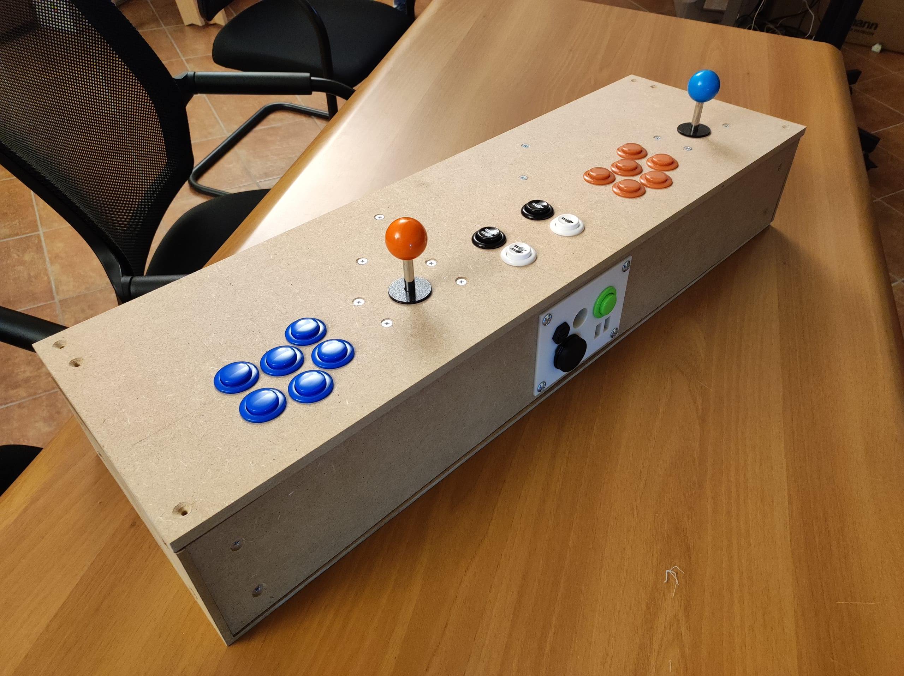
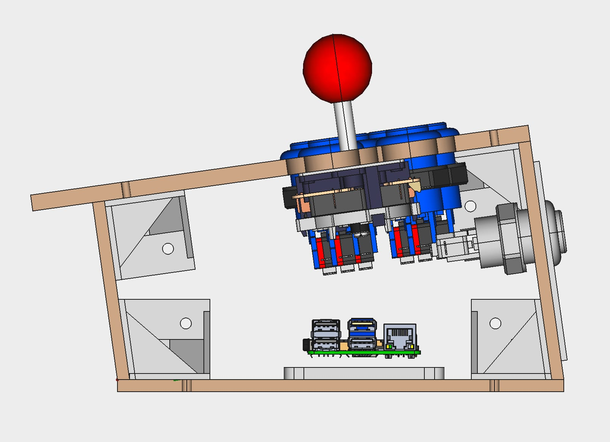

---
# ─────────────────────────────────────────────────────────────────────
# OBBLIGATORI — senza uno di questi la build fallisce e la PR resta rossa
# ─────────────────────────────────────────────────────────────────────
title: Gorgo Lab Mamecab
summary: Un arcade stick artigianale per rivivere l'era dei Coin-Op.
date: 2024-10-30
authors:
  - Gorgo Lab
tags:
  - fai-da-te
  - stampa-3d
  - falegnameria

cover: ./mamecab1.jpg
coverAlt: arcade stick su un tavolo

# ─────────────────────────────────────────────────────────────────────
# SOLO PER I PROGETTI (nel blog questi campi non esistono)
# ─────────────────────────────────────────────────────────────────────
status: completato        # idea | in-corso | completato | sospeso

# ─────────────────────────────────────────────────────────────────────
# FACOLTATIVI — togli quelli che non ti servono, non lasciarli vuoti
# ─────────────────────────────────────────────────────────────────────
updated: 2024-10-30

gallery:
  - ./mamecab1.jpg
  - ./mamecab2.jpg
  - ./pacman.jpg
  - ./freecad.jpg
galleryAlt:                 # uno per ogni immagine, nello stesso ordine
  - arcade stick su un tavolo
  - arcade stick su un tavolo
  - schermata di pac-manca
  - screenshot da Freecad con vista laterale

attachments:
  - file: misure-leroy-merlin-pag1.pdf
    label: Misure tagli MDF 1
    note: Appunti per taglio legno
  - file: misure-leroy-merlin-pag2.pdf
    label: Misure tagli MDF 2
    note: Appunti per taglio legno
  - file: BOM-Arcade-Stick.csv
    label: Distinta dei materiali

links:
  - label: Documentazione e file su Google Drive
    url: https://drive.google.com/drive/folders/1wKV3zL4FGM6Lb-5j2NEzqhrQqY-BA3ax

license: CC BY-SA 4.0

# featured: true          # in evidenza in home — lo alza chi cura il sito
# draft: true             # non ancora pubblico: visibile solo in locale e nelle PR
---

Al GorgoLab, abbiamo deciso di intraprendere un progetto che ci riportasse ai
gloriosi giorni delle sale giochi anni '80, quando i coin-op dominavano la scena
videoludica. Nasce così il nostro Mamecab, un controller arcade artigianale e
fai-da-te, pensato per rivivere le emozioni dei giochi classici anni '70, '80 e
'90, come ad esempio Pac-Man, Donkey Kong, Space Invaders, Bubble Bobble e
tantissimi altri.

## Progettazione e Realizzazione

Il nostro Mamecab è stato interamente progettato e costruito all'interno del
GorgoLab, utilizzando una combinazione di materiali e tecnologie che
rappresentano al meglio lo spirito del nostro makerspace:

- *Struttura in Legno*: Abbiamo scelto il legno come materiale principale per la
struttura del nostro Mamecab, per garantire robustezza e un aspetto autentico,
in linea con i classici cabinati arcade.
- *Componenti Stampati in 3D*: Alcuni dettagli e supporti sono stati realizzati
con la nostra stampante 3D.
- *Cablaggi e Elettronica*: Il cuore pulsante del Mamecab è un Raspberry Pi,
su cui è installato MAME (Multiple Arcade Machine Emulator), un software open
source che emula perfettamente i vecchi giochi arcade. Il cablaggio è stato
realizzato con cura, utilizzando componenti di qualità per garantire la massima
reattività e precisione dei comandi.
- Design Compatto: Il Mamecab è progettato per essere appoggiato su un tavolo,
mantenendo però tutte le caratteristiche di un vero cabinato arcade. I joystick
e i pulsanti replicano fedelmente la sensazione dei giochi originali, offrendo
un'esperienza di gioco coinvolgente e nostalgica.

## Software Open Source e Condivisione con la Comunità

Uno degli aspetti fondamentali del nostro progetto è l'utilizzo esclusivo di
software open source. Abbiamo scelto di supportare la comunità open source
perché crediamo nella condivisione delle conoscenze e nella collaborazione.
Per questo motivo, tutto il materiale prodotto durante la realizzazione del
Mamecab, inclusi gli schematici, i progetti e il software, è messo a disposizione
della comunità. Chiunque può accedere, utilizzare e modificare questi materiali
per creare il proprio Mamecab o per trarre ispirazione per altri progetti.

<Callout type="info" title="MAME è libero, i giochi no">
L'emulatore è open source, ma le ROM dei coin-op restano coperte da copyright:
si usano quelle di cui si possiede l'originale, o quelle che i detentori dei
diritti hanno liberato. È l'unico pezzo del Mamecab che non possiamo condividere
con voi.
</Callout>

In fondo a questa pagina puoi trovare i files del progetto da scaricare oppure
puoi visitare il seguente link:

[Documentazione e files su Google Drive](https://drive.google.com/drive/folders/1wKV3zL4FGM6Lb-5j2NEzqhrQqY-BA3ax?usp=sharing)

## Un Progetto Aperto e Condiviso

Il nostro obiettivo è stato quello di realizzare un prodotto che non solo
rispecchiasse l’estetica e la funzionalità dei vecchi coin-op, ma che fosse anche
completamente fai-da-te. Ogni fase del progetto, dalla progettazione alla
costruzione, è stata documentata e sarà disponibile sul nostro sito per chiunque
voglia replicare o migliorare il progetto.

Il Mamecab di GorgoLab non è solo un ritorno al passato, ma un tributo all’ingegno
e alla creatività dei nostri membri. È un progetto che incarna la filosofia del
makerspace: imparare facendo, condividere conoscenze, e creare qualcosa di unico e
divertente.