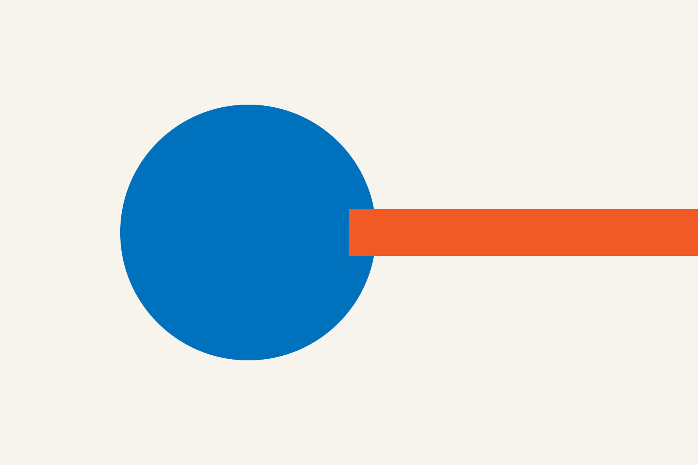
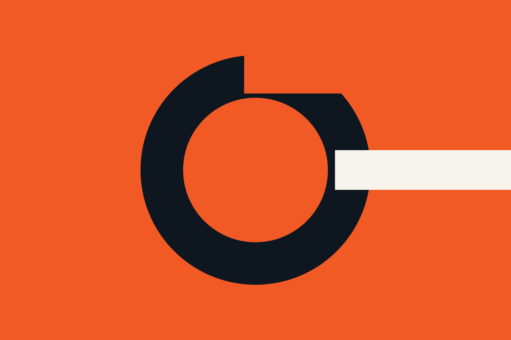

---
# ─────────────────────────────────────────────────────────────────────
# SOLO PER IL MODELLO — quando copi questo file, CANCELLA LA RIGA QUI SOTTO.
# Il modello è una bozza: si vede in locale e nelle anteprime delle PR, non
# sul sito pubblico. Se la lasci, anche il tuo progetto resterà invisibile.
# ─────────────────────────────────────────────────────────────────────
draft: true

# ─────────────────────────────────────────────────────────────────────
# OBBLIGATORI — senza uno di questi la build fallisce e la PR resta rossa
# ─────────────────────────────────────────────────────────────────────
title: Modello di una pagina di progetto
summary: La pagina che copia-incolli quando pubblichi il tuo progetto. Contiene ogni formattazione disponibile, con la spiegazione di quando usarla e quando lasciar perdere.
date: 2026-08-27
authors:
  - Gorgo Lab
tags:
  - fai-da-te
  - stampa-3d
  - elettronica
  - falegnameria
  - programmazione
  - laser
cover: ./copertina.jpg
coverAlt: Composizione geometrica arancione e blu, segnaposto della copertina

# ─────────────────────────────────────────────────────────────────────
# SOLO PER I PROGETTI (nel blog questi campi non esistono)
# ─────────────────────────────────────────────────────────────────────
status: completato        # idea | in-corso | completato | sospeso

# ─────────────────────────────────────────────────────────────────────
# FACOLTATIVI — togli quelli che non ti servono, non lasciarli vuoti
# ─────────────────────────────────────────────────────────────────────
updated: 2026-08-27

gallery:
  - ./galleria-01.jpg
  - ./galleria-02.jpg
  - ./galleria-03.jpg
galleryAlt:                 # uno per ogni immagine, nello stesso ordine
  - Le parti tagliate al laser, prima del montaggio
  - Il giunto a coda di rondine visto da vicino
  - Il pezzo finito appoggiato sul banco

attachments:
  - file: schema-elettrico.pdf
    label: Schema elettrico
    note: KiCad 8, esportato in PDF
  - file: sorgenti.zip
    label: Sorgenti CAD e PCB
    note: FreeCAD 1.0 e KiCad 8
  - file: staffa.stl
    label: Staffa da stampare
    note: PETG, 40% riempimento, senza supporti
  - file: taglio-laser.svg
    label: Tracciati per il laser
    note: rosso 0.1 mm = taglio
  - file: misure.csv
    label: Distinta dei materiali
  - file: firmware.ino
    label: Firmware Arduino

links:
  - label: Repository su GitHub
    url: https://github.com/esempio/modello
  - label: Il modello su Printables
    url: https://www.printables.com
  - label: Wikipedia
    url: https://www.wikipedia.org

license: CC BY-SA 4.0

# featured: true          # in evidenza in home — lo alza chi cura il sito
# draft: true             # non ancora pubblico: visibile solo in locale e nelle PR
---

<Callout type="info" title="Questa pagina è un modello">
Non è un progetto vero del lab: è il campionario di tutto quello che puoi
mettere in una pagina. Copia la cartella, cancella quello che non ti serve e
sostituisci il resto. Il sorgente è il file `index.mdx` qui accanto.
</Callout>

Le prime righe che scrivi finiscono nell'anteprima e in cima alla pagina, quindi
falle contare: **cosa hai costruito, perché, e come è andata a finire**. Chi legge
decide qui se continuare. Il resto della pagina lo spieghi dopo.

Il testo normale si scrive senza pensarci: **grassetto** per le cose che contano,
*corsivo* per gli incisi, `codice inline` per nomi di file, comandi e valori, e i
[collegamenti](https://www.gorgolab.it) si scrivono così. Non serve — anzi, è
sconsigliato — scrivere HTML a mano: allo stile pensa il sito.

## I titoli danno la struttura

Questo è un titolo di secondo livello, `##`. Usa questi per le fasi del lavoro:
l'idea, il primo tentativo, cosa è andato storto, come l'hai risolto. Compaiono
in automatico nell'indice qui a fianco, quindi scrivili come voci di indice, non
come battute.

### Il terzo livello sta sotto al secondo

`###` per i passaggi dentro una fase. Sotto ancora c'è `####`, che diventa una
piccola etichetta arancione: usalo di rado, quando serve davvero un quarto
livello.

#### Etichetta di quarto livello

Se stai usando quattro livelli di titoli, probabilmente il progetto va spezzato
in due pagine.

## Elenchi

Puntato, per le cose senza un ordine:

- Il PETG regge il calore molto meglio del PLA.
- Le viti a testa svasata vogliono lo svaso, altrimenti non tirano dritto.
- Un cuscinetto entra a pressione una volta sola: la seconda balla.

Numerato, per le cose che vanno fatte in sequenza:

1. Taglia i fianchi al laser e leva la pellicola **prima** di incollare.
2. Stampa le quattro staffe: due ore l'una, mettile in coda la sera.
3. Monta a secco tutto quanto, senza colla, e verifica le squadre.
4. Solo adesso incolla, e stringi con i morsetti per un'ora.

Le liste si annidano rientrando di due spazi:

- Materiali di consumo
  - Filamento PETG, circa 180 g
  - Colla vinilica D3
- Utensili che trovi in lab
  - Laser, stampante 3D, morsetti
  - Chiave dinamometrica, se ti serve la coppia giusta

## Tabelle

Buone per confronti e misure. Su telefono scorrono in orizzontale da sole, ma
tienile strette: tre o quattro colonne al massimo.

| Materiale | Spessore | Prova di carico | Verdetto |
| --- | --- | --- | --- |
| PLA | 4 mm | si deforma a 45 °C | scartato |
| PETG | 4 mm | regge fino a 70 °C | **scelto** |
| ABS | 3 mm | regge, ma si imbarca in stampa | scartato |

## Immagini

Un'immagine si richiama con il percorso relativo dentro la tua cartella. Il sito
la ridimensiona, la converte e ne genera le versioni per telefono e desktop: tu
carica il file grosso che esce dalla fotocamera e non pensarci.



Il testo fra parentesi quadre è la **descrizione alternativa**: la legge chi non
vede la foto, quindi descrivi cosa si vede, non ripetere la didascalia. Il testo
fra virgolette dopo il percorso è la **didascalia** e compare sotto la foto. La
didascalia è facoltativa; la descrizione no.



Senza virgolette non esce nessuna didascalia, come qui sopra.

## Video

I video si incorporano da YouTube o Vimeo, **mai** caricati come file: un video
nel repository lo appesantisce per sempre, anche se poi lo cancelli. Serve solo
l'identificativo, non l'indirizzo intero.

<Video provider="youtube" id="aqz-KE-bpKQ" title="Il meccanismo in funzione, ripreso di lato" />

Fino al click non parte niente verso YouTube: nessun cookie, nessun tracciamento,
e la pagina resta leggera. Per Vimeo si scrive `provider="vimeo"`.

## Riquadri di richiamo

Quattro tipi, da usare con parsimonia: se ne metti uno ogni due paragrafi non li
guarda più nessuno.

<Callout type="info" title="Nota di contesto">
Per le informazioni utili ma non urgenti. Senza `title` viene scritto "Nota".
</Callout>

<Callout type="tip" title="Il trucco che ci ha risparmiato ore">
Per le scorciatoie che hai scoperto sbattendoci la testa. Questi sono i riquadri
che i lettori ringraziano di più.
</Callout>

<Callout type="warning" title="Attenzione">
Per le cose che si rompono se le sbagli. Per esempio: l'alimentatore va collegato
**prima** di innestare i servo, altrimenti saluti la scheda.
</Callout>

<Callout type="danger" title="Pericolo">
Solo per la sicurezza delle persone: tensione di rete, laser senza carter, resine
da maneggiare con i guanti. Non usarlo per enfasi.
</Callout>

## Specifiche tecniche

Per i dati secchi che uno cerca a colpo d'occhio. Non metterci il racconto.

<Specs items={[
  ["Dimensioni", "320 × 180 × 95 mm"],
  ["Materiale", "compensato di pioppo 4 mm, PETG"],
  ["Elettronica", "ESP32-WROOM-32"],
  ["Alimentazione", "5 V / 2 A, presa USB-C"],
  ["Peso", "480 g"],
  ["Tempo di realizzazione", "circa 12 ore, spalmate su tre serate"],
]} />

## Codice

I blocchi di codice si aprono e si chiudono con tre apici inversi, con il nome
del linguaggio subito dopo i primi tre: serve a colorare le parole giuste.

```cpp
// Angoli di spalla e gomito per raggiungere il punto (x, y).
bool solve(float x, float y, float &shoulder, float &elbow) {
  const float d2 = x * x + y * y;
  if (sqrtf(d2) > L1 + L2) return false;  // fuori portata

  const float cosElbow = (d2 - L1 * L1 - L2 * L2) / (2 * L1 * L2);
  elbow = acosf(constrain(cosElbow, -1.0f, 1.0f));
  shoulder = atan2f(y, x) - atan2f(L2 * sinf(elbow), L1 + L2 * cosf(elbow));
  return true;
}
```

Funziona con qualunque linguaggio — `python`, `bash`, `json`, `yaml`, `cpp`,
`html` — e anche senza indicarlo, ma allora resta tutto grigio.

```python
# Genera i tracciati di taglio a partire dalle misure della distinta.
import csv

with open("misure.csv", encoding="utf-8") as f:
    for pezzo in csv.DictReader(f):
        if pezzo["materiale"].startswith("compensato"):
            print(pezzo["pezzo"], pezzo["spessore_mm"], "mm")
```

```bash
# I comandi si scrivono così, uno per riga, con il commento sopra.
openscad -o staffa.stl -D 'spessore=4' staffa.scad
```

## Citazioni

Per riportare le parole di qualcun altro, o per staccare un'idea dal resto.

> Il compensato di pioppo brucia sui bordi molto più del betulla. Bello se ti
> piace l'effetto, meno se volevi il legno chiaro.

## Separatore

Quando cambi proprio argomento, tre trattini fanno una riga di stacco.

---

## Collegamenti a risorse esterne

Dentro il testo un collegamento si scrive con le quadre e le tonde: la voce di
[Wikipedia](https://www.wikipedia.org) che spiega la tecnica, il datasheet del
componente, il negozio dove hai trovato il pezzo introvabile.

```markdown
la voce di [Wikipedia](https://www.wikipedia.org) che spiega la tecnica
```

Usalo quando il collegamento serve **in quel punto del discorso**, come si cita
una fonte leggendo.

Se invece è una destinazione stabile del progetto — il repository, la pagina su
Printables, la scheda del materiale — non metterla nel testo: dichiarala in cima
al file, nel blocco `links`.

```yaml
links:
  - label: Repository su GitHub
    url: https://github.com/esempio/modello
  - label: Wikipedia
    url: https://www.wikipedia.org
```

Quelli finiscono nella colonna qui a fianco, sotto "Link esterni", sempre nello
stesso posto: chi cerca la fonte del progetto sa già dove guardare, senza
rileggersi la pagina in cerca di una parola sottolineata. Il `label` è il testo
che si legge, non l'indirizzo: scrivi "Il modello su Printables", non
"printables.com/model/12345".

<Callout type="warning" title="I collegamenti esterni non li controlla nessuno">
`check:links` verifica solo i collegamenti interni al sito. Quelli esterni non
vengono contattati apposta — un sito altrui giù per manutenzione farebbe
fallire la CI di tutti — quindi un indirizzo sbagliato lo scopre chi ci clicca.
Provali prima di aprire la pull request.
</Callout>

## Come sono fatti gli allegati

I file scaricabili non si linkano nel testo: si dichiarano in cima al file, nel
blocco `attachments`, e il sito li impagina da solo in fondo alla pagina, con
l'icona giusta per tipo. Se dichiari un file che non c'è, la build fallisce e la
PR te lo dice: meglio un errore subito che un collegamento morto per due anni.

Le estensioni ammesse sono `pdf`, `zip`, `stl`, `step`, `3mf`, `svg`, `dxf`,
`ino`, `sch`, `csv`, `txt`, `gcode`. Se hai un formato diverso, mettilo dentro
uno zip.

## Cosa NON puoi fare, e perché

- **Niente HTML scritto a mano.** Niente `<div>`, niente `style=`. Se il testo ha
  bisogno di una formattazione che non trovi qui, chiedila a chi cura il sito:
  o esiste già, o va aggiunta per tutti.
- **Niente video caricati come file.** Solo incorporati.
- **Niente foto sopra i 2 MB o i 3000 pixel di lato.** Un controllo automatico
  blocca la PR. Se ti mandano il progetto in uno zip, `npm run ingest` sistema
  tutto da solo.
- **Niente tag inventati.** Al massimo sei, presi dalla lista in
  `src/site.config.ts`. Se manca quello che ti serve, aggiungilo in quella stessa
  PR: è un attrito voluto, serve a non ritrovarsi con "stampa3d", "stampa-3d" e
  "3dprint" come tre cose diverse.

## Prima di aprire la pull request

```bash
npm run dev        # guarda la tua pagina su http://localhost:4321
npm run validate   # gli stessi controlli che girano sulla PR
```

Se `validate` passa in locale, passa anche in CI. Se non passa, il messaggio dice
quale campo sistemare.

<Callout type="tip" title="La regola vera">
Documenta anche quello che è andato storto. Le pagine utili non sono quelle in
cui tutto è filato liscio: sono quelle che ti risparmiano l'errore che ha già
fatto qualcun altro.
</Callout>
